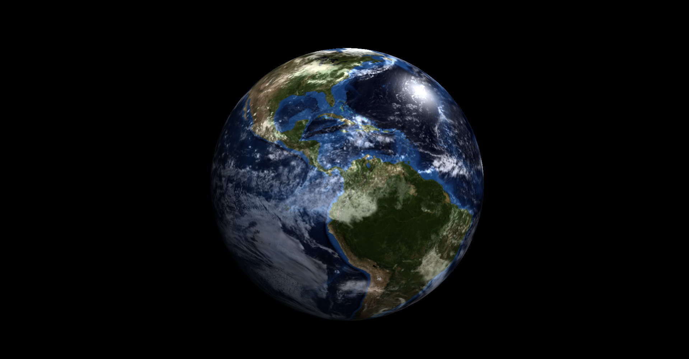

<h1>EarthGL</h1>
<section>
    This project is being developed for that I can practice everything I learned from my studies about OpenGL. My goal is to reproduce the planet earth's view in space. I'll use <a href="https://www.glfw.org/download.html">GLFW</a>, <a href="https://glad.dav1d.de/">GLAD</a>, <a href="https://glm.g-truc.net/0.9.9/">GLM</a>, <a href="https://github.com/nothings/stb">STB</a> and C/C++ to be able to use OpenGL and finish the project.
     
    
</section>
 
<h2>Credits</h2>
<section>
    This project is inspired by a project called <a href="https://www.youtube.com/watch?v=eDFXFgd_flA&ab_channel=ThalesSabino"><i>Blue Marble</i></a> created by the YouTube channel <a href="https://www.youtube.com/channel/UCFZCPq--PwSkfVkkRsRUUqQ"><i>Thales Sabino</a></i>. I would also like to thank you for helping me to enter the world of computer graphics, teaching all the necessary fundamentals.
</section>
 
<h2>Honorable Mentions</h2>
<section>
    I would also like to thank and recommend: 
<a href="https://www.youtube.com/c/TheChernoProject"><b>• The Cherno:</a></b> An amazing YouTube channel that taught me (and still teaches) a lot about C++ and OpenGL. 
<a href="https://www.youtube.com/c/VictorGordan"><b>• Victor Gordan:</a></b>Another amazing YouTube channel that taught me a lot about OpenGL and the fundamentals of computer graphics. 
<a href="https://learnopengl.com/"><b>• Learn OpenGL:</b></a> An amazing site that provides computer graphics with OpenGL, from the basics to the most advanced content.
</section>
