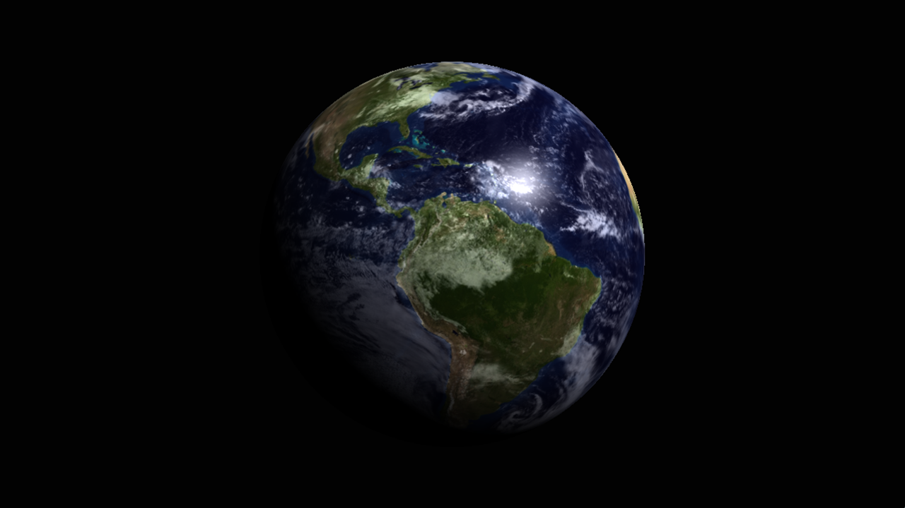

# EarthGL

A small 3D scene with the planet Earth in space programmed from scratch with C++ and modern OpenGL. I made this project to practice my graphics programming skills and also because I was inspired by a similar project from one of my computer graphics professors.



## Build

**1.** You'll need CMake to build this project.  
**2.** After CMake installation, clone this repository using the following command:

  ```sh
  git clone https://github.com/TheSampaio/EarthGL --recursive
  ```
**3.** Open the project with your preferred IDE (I recommend Visual Studio for Windows).  
**4.** Now, just build with CMake and run the executable program.

## Credits

The inspiration for my project was another one called [_Blue Marble_](https://www.youtube.com/watch?v=eDFXFgd_flA&ab_channel=ThalesSabino) made by my professor [_Thales Sabino_](https://www.youtube.com/channel/UCFZCPq--PwSkfVkkRsRUUqQ) for his YouTube channel. I would also like to thank him for helping me enter the world of computer graphics and teaching me all the necessary fundamentals.

## Acknowledgments

I would also like to thank and recommend:

- **[The Cherno](https://www.youtube.com/c/TheChernoProject)**: An amazing YouTube channel that taught me (and still teaches) a lot about C++ and OpenGL.
- **[Victor Gordan](https://www.youtube.com/c/VictorGordan)**: Another amazing YouTube channel that taught me a lot about OpenGL and the fundamentals of computer graphics.
- **[Learn OpenGL](https://learnopengl.com/)**: A fantastic site that provides computer graphics tutorials with OpenGL, from the basics to advanced content.

## License

This project is licensed under the Apache License 2.0. You are free to use, modify, and distribute this project, but you must credit the original author. For more details, visit: [Apache License 2.0](http://www.apache.org/licenses/LICENSE-2.0).

